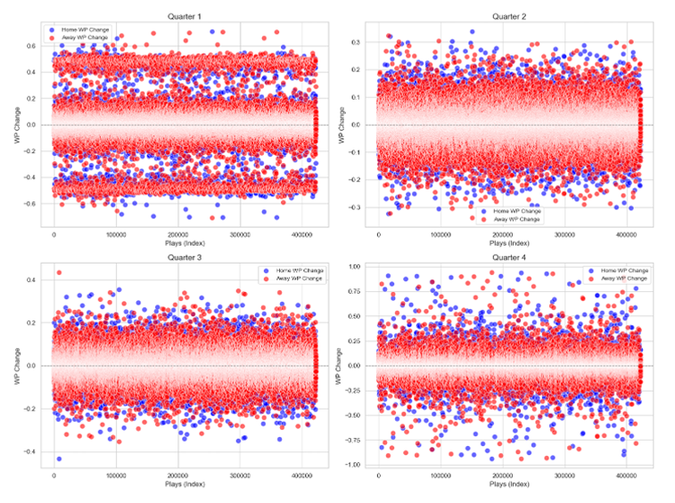
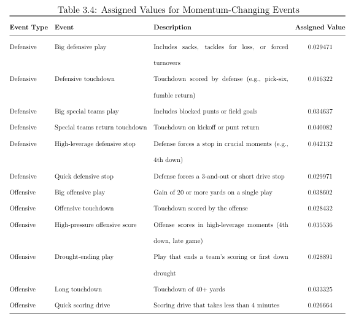
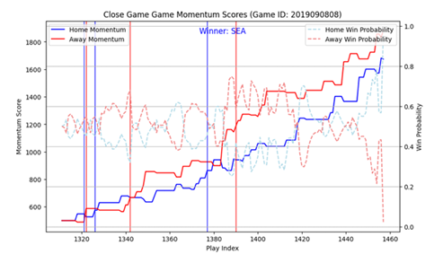
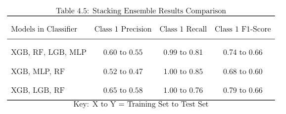
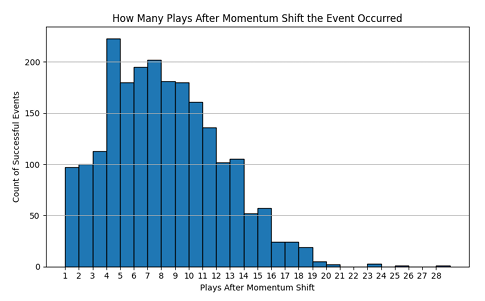

# NFL Momentum Shift Modeling (Play-by-Play Analytics)
## Executive Summary
Momentum in NFL games is modeled as a measurable, non-random game dynamic that predicts short-term success rather than guaranteed wins. Using 10+ seasons of play-by-play data, I built a momentum score system based on weighted momentum-changing events informed by controlled win probability behavior. Multiple models were trained to predict momentum shifts, and an event-based ad hoc validation evaluated whether predicted shifts led to success events (score, defensive stop + possession, or sustained drive success). Results show momentum differs meaningfully from win probability: it builds progressively, can be gained by either team regardless of expected outcome, and can be stalled rather than fully lost. Predicted shifts were followed by a success event ~64% of the time, supporting that momentum-driven short-term success is not random.

## Decision Context
- Goal: identify “momentum shift” moments that increase the likelihood of near-term success events (score, stop+possession, sustained drive).
- Intended use: decision support and game-flow context (not deterministic predictions of who wins).
- Why it matters: win probability is outcome-focused, momentum is designed to capture game control and short-term bursts that can inform strategy.

## Dataset
- Dataset compiled of all seasons 2009 - 2019 from NFLFastR
- Granularity: play-level
- Core context features: quarter/time remaining, score differential, home/away, streak states, event type, win probability.

## Key Findings
Momentum is distinct from win probability: similar shape, but diverges because WP heavily weights time/score; momentum down-weights endgame effects to measure game control.

Predicted momentum shifts were followed by a success event ~64% of the time (score, stop+possession, sustained drive).

Context matters: one-score games and late-game situations show higher volatility and more impactful events.

Ensemble modeling improved detection: stacking increased recall to ~0.81 and F1 to ~0.66 vs standalone models.

## Exploratory Insights
Impact varies by quarter: max WP swings were modest mid-game (often < 10% in Q2, Q3) but extreme early and late (often > ~80% in Q1, Q4), motivating quarter-based weighting.

Game closeness drives volatility: one-score games produced the largest WP sensitivity, so event values were derived under controlled “competitive balance” conditions.

Home/away asymmetry exists: away teams saw larger early WP gains for similar events; late-game shifts often favored home teams, motivating home/away and boost-case weights.

Streaks amplify perceived control: consecutive scores/stops showed increasing WP effects, supporting streak-based scaling in momentum gains.

"Big" plays, Quick Scores, and Sustained Drives: Often led to larger win probability swings, in team and fan views these are perceived as momentum gaining types of plays.

## High-Level Approach
Explore WP behavior across contexts to quantify event impact under controlled conditions.

Create momentum event values + contextual weights (streak/score/quarter/home-away/boost/decay).

Detect momentum shifts using a dynamic threshold (historical baseline + within-game scaling).

Train models (XGBoost + stacked ensemble) to predict shift events.

Validate predicted shifts using outcome-based ad hoc success criteria with a temporal play window.

## Results
### Win Probability Impact by Quarter

*Figure: Maximum win probability change varies significantly by quarter, motivating quarter-based weighting in the momentum score framework.*

### Assigned Momentum Changing Events

*Table: The events that were assigned as momentum changing events and their controlled impact values.*

### Win Probability vs Momentum Scores Shape Comparison

*Figure: Comparison of the shape of Win Probability and Momentum Scores, with momentum shifts shown and the overall winner.*

### Ensemble Combination Metrics

*Table: Different ensemble model combinations and their metric results.*

### Number of Plays for Successful Event to occur after Momentum Shift

*Figure: Plays after Momentum Shift for a defined successful event to occur.*

## Limitations/Future Improvements
Define more events that are considered short term success in game context.

More features such as weather, injuries, timeouts, team strength, previous game momentum scores, special teams plays could improve results further and bring more insights.

Carry over momentum scores into the next game throughout seasons to better reflect real world momentum views.

Reduce feature engineering complexity by consolidating correlated event-based and contextual features into a smaller set of higher-level indicators. This would improve robustness, reduce sensitivity to noisy play-level signals, and enable faster real-time evaluation without sacrificing interpretability.

## Potential Uses
Coaches could use to determine when to change aggression and formations with play calling.

Dynamic real time changes to help change live sports betting odds.

Enhance viewing experience by showing teams gaining and losing momentum, could predict big plays or changes in game will happen soon.

Improvements to other models for player impact, AI game simulations, and team success forecasting.

## Full thesis text and figures: https://dc.ewu.edu/theses/989/

